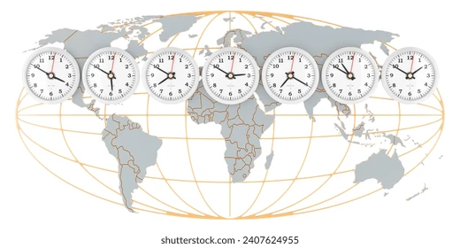

# Cairo Event Time Manager

A static browser tool for converting copied event text into Cairo time. It is designed for Meetup, Eventbrite, Google Calendar, and similar event pages.

## Use

Open `index.html` in a browser, paste event text, then click **Convert and Save**.

Primary rule:

```text
Use the event timezone first:
EEST, GMT+03:00, UTC+03:00, or Google Calendar's timezone line.
```

Second solution:

```text
Use Host/timezone override only when the event has no timezone,
the timezone is unclear, or you want to compare against the host city.
```

Example:

```text
Saturday, Jun 27 - 6:00 PM to 8:00 PM EEST
```

If Cairo is also UTC+3 on that date, the Cairo time stays:

```text
Saturday, Jun 27 - 6:00 PM to 8:00 PM Cairo time
```

## GitHub Pages

This repo can be deployed directly from the `main` branch because it is a static HTML app.

In GitHub:

```text
Settings -> Pages -> Build and deployment
Source: Deploy from a branch
Branch: main
Folder: / (root)
```

## Notes

- No server or Python backend is required for the browser app.
- Saved events are stored in the browser's local storage.
- Events saved on Ubuntu and events saved on a phone are separate.
- Avoid committing private event notes to a public repository.
